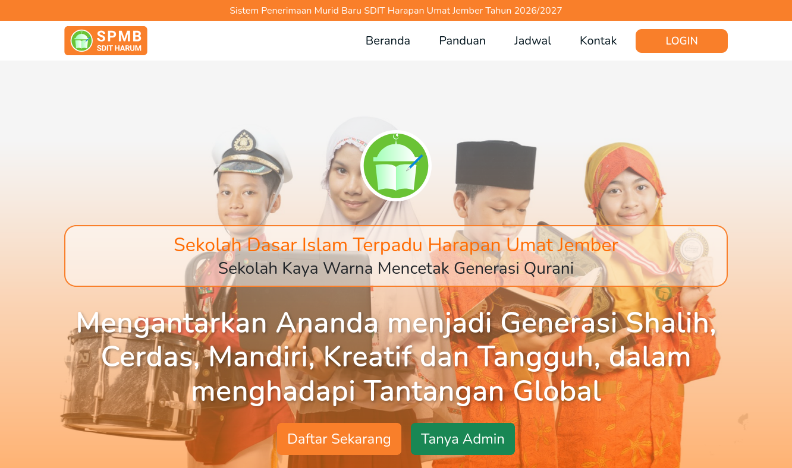

# PPDB SDIT - Student Admission System

A web-based student admission system for Integrated Islamic Elementary Schools (SDIT). Manages the entire new student enrollment process from online registration, form submission, selection, to re-enrollment payment.

## Screenshot

<p align="center">
  
</p>

## Features

### Student / Parent Portal
- New account registration
- Photo & document upload
- Student biodata form submission
- Parent / guardian data entry
- Profile & registration history view
- PPDB timeline stage overview
- Re-enrollment fee information

### Admin Dashboard
- User management (student/parent accounts)
- Student data management (details, edit, Excel export)
- Re-enrollment payment management & receipt printing
- Cost setup per category
- PPDB timeline stage configuration
- Contact & landing page settings
- Student account activation / rejection
- Registration statistics

### Roles & Registration Flow

| Role | Description |
|------|-------------|
| `admin` | Full access to all features |
| `akun_dibuat` | New account, uploading documents |
| `akun_aktif` | Account activated by admin |
| `akun_isi_formulir` | Registration form completed |
| `akun_diterima` | Accepted after selection |
| `akun_ditolak` | Rejected after selection |
| `akun_mengundurkan_diri` | Withdrawn |
| `akun_nonaktif` | Inactive account |

## Tech Stack

- **Backend:** Laravel 10
- **Frontend:** Bootstrap 5 + SASS + Vite
- **Database:** MySQL
- **Auth:** Laravel Sanctum + Spatie Permission
- **Export:** Maatwebsite/Excel

## Database

Main tables:

| Table | Description |
|-------|-------------|
| `users` | User accounts |
| `students` | Student data (biodata, parents, address) |
| `documents` | Uploaded documents & photos |
| `payments` | Re-enrollment payment records |
| `cost_categories` | Fee categories |
| `timelines` | PPDB stage timelines |
| `settings` | System & landing page settings |

## Folder Structure

```
app/
├── Console/
├── Exceptions/
├── Exports/            # Excel exports
├── Http/
│   └── Controllers/    # 10 controllers
├── Models/             # 7 models
├── Providers/
database/
├── migrations/         # 12 migration files
├── seeders/
resources/
├── views/
│   ├── admin/          # Admin dashboard
│   ├── student/        # Student portal
│   ├── landing/        # Public page
│   └── layouts/        # Main layouts
routes/
├── web.php             # Main routes
```

## License

Proprietary - For internal use by SDIT schools/institutions.
